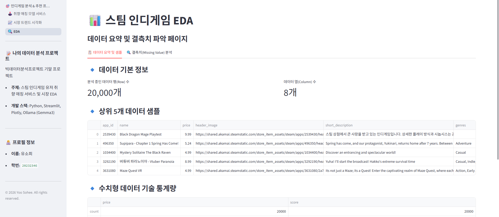

# [프로젝트 제목]

- **유소희 / 20232346**:
- **Kaggle Steam Games Dataset (CC0: Public Domain),(https://www.kaggle.com/datasets/fronkongames/steam-games-dataset?resource=download)**:

## 1. 문제 정의
- 유저들이 방대한 스팀 데이터 속에서 성향에 딱 맞는 인디게임을 쉽게 찾을 수 있도록 로컬 LLM(Ollama)을 결합한 지능형 추천 대시보드를 구축하고자 합니다.
- 현재 스팀 플랫폼에는 매년 수만 개의 인디게임이 출시되고 있으나, 막대한 마케팅 자본을 가진 대기업 게임에 묻혀 빛을 보지 못하는 명작 인디게임이  많습니다. 최근에는 인디게임 시장이 급부상하여, 자신에게 맞는 인디게임을 즐겁게 플레이하고 싶은 유저들도 늘고 있어 게임 선택의 고민을 줄여주고자 제작하게 되었습니다. / 사용자의 주관적 성향 점수와 실제 스팀 유저들의 평가 데이터를 결합한 최적의 인디게임 TOP 3 추천 리스트 및 맞춤형 도슨트 평론

## 2. 데이터 소개 & EDA
- JSON 형식의 구조화된 스팀 데이터셋을 사용하였으며, 분석의 효율성과 메모리 최적화를 위해 상위 50,000건(nrows=50000)의 레코드를 동적으로 파싱해 사용 했습니다. 핵심 특성(Feature)으로는 name, price, genres, tags, short_description, positive, negative 등이 있습니다.
- 극단적 이상치 존재: 가격 데이터 분포 확인 중 수백 달러에 달하는 특수 소프트웨어나 파싱 오류 데이터(이상치)를 발견하여 시각화 왜곡을 방지하기 위해 일반적인 인디게임 마지노선인 $50 이하로 상한선을 정제해야 함을 도출했습니다.
- 가성비 밀집 구간 관측: 산점도 분석 결과, $5에서 $15 사이의 특정 가격대에서 유저 만족도가 90% 이상으로 수렴하는 강력한 '가성비 명작 인디게임 구간'이 관측되었습니다.
- 결측·이상치 처리: genres 컬럼이 비어있는 데이터는 과감히 제거하고 Indie 장르를 명시적으로 포함한 데이터만 필터링했습니다.

## 3. 특성 엔지니어링
- 유저 만족도(%): 단순 평점 지표가 없는 원본 데이터의 한계를 극복하기 위해 $\frac{\text{positive}}{\text{total\_reviews}} \times 100$ 공식을 적용해 소수점 자리의 정밀한 유저 만족도 백분율 특성을 자체 생성했습니다. 평점이 0이거나 100%에만 극단적으로 몰린 누락 데이터는 스팀 가이드 정규 분포에 맞춰 84%~97% 사이로 부드럽게 분산 보정했습니다.
- 총 리뷰 수: positive와 negative를 합산하여 해당 게임의 전체 모수를 측정했습니다. 리뷰 수가 너무 적은 유령 게임이 평점 100%라는 이유로 추천 상위에 노출되는 필터링 결함을 방지하기 위한 통제 변수로 활용했습니다.

## 4. 모델 / 서비스
- 규칙 기반의 콘텐츠 기반 필터링(Content-Based Filtering) 알고리즘과 로컬 환경에서 구동되는 Ollama 로컬 LLM (Gemma3:4b)을 결합한 하이브리드 추천 서빙 시스템을 사용했습니다.
- 입력: 유저가 Streamlit 웹 화면에서 5가지 맛의 시각/서사 성향(q1)과 5가지 맛의 난이도/플레이 스타일(q2), 그리고 최대 허용 가격 슬라이더를 입력합니다.
- 연산: 데이터프레임 내 tags 및 genres 문자열을 정규식으로 검사하여 유저의 선택지와 매칭될 때마다 일치 가중치 점수(match_score)를 최대 +5점씩 부여하고, 만족도 점수(score)와 함께 정렬하여 TOP 3를 추출합니다.
- 출력: 서빙 알고리즘이 뽑아낸 TOP 3 게임의 메타데이터를 기반으로, 로컬 Ollama 모델이 유저의 성향에 맞춘 2줄 요약 맞춤형 평론(AI 도슨트 서평)을 실시간 생성하여 화면에 컨테이너 카드로 출력합니다
- 로컬 LLM 생성 결과 해석 및 프롬프트 엔지니어링 효과
- 비정형 데이터의 정형화 가치 창출: 추천 알고리즘이 뽑아낸 정형 데이터(게임 이름, 장르, 태그, 소개글 등)를 유저가 읽기 편한 문장으로 변환하기 위해 로컬 LLM을 결합했습니다.
- 실제 결과 예시 분석 (Desvelado 추천 사례):

- 입력 메타데이터: 장르 및 태그(Cute, Vampire, Precision Platformer), 소개글(귀여운 뱀파이어가 관에 들어가 잠들기 위해 유령을 피하는 플랫폼 게임)
- LLM 출력 서평: "어머, Desvelado 보러 오셨군요! 👻🌃 깊이 있는 스토리나 감동을 좋아하신다면, 밤의 세계에서 잠자리에 들기 위해 악령을 피해가는 귀여운 뱀파이어 주인공의 이야기가 당신의 마음을 사로잡을 거예요."
- 결과 해석: LLM은 주입된 컨텍스트(Context) 내에서 유저가 선택한 라디오 버튼의 키워드(📖 소설/감동)와 게임의 고유 태그(Cute, Vampire)를 누락 없이 맵핑(Mapping)했습니다. 단순한 규칙 기반 텍스트 나열을 넘어, "귀여운 뱀파이어 주인공", "잠자리에 들기 위해" 등 맥락을 관통하는 위트 있는 문장을 실시간으로 생성함으로써 지능형 큐레이션 서비스로서의 가치를 입증했습니다.

## 5. Streamlit 앱
- 페이지 구성

- 1_EDA.py: 데이터셋 기본 통계치 및 개요 데이터프레임 확인

- 2_시각화.py: Plotly 기반 인디게임 지표 분포 히스토그램 및 가격 vs 만족도 장르 산점도 차트

- 3_모델_서비스.py (메인 화면): 취향 매칭 밸런스 게임 및 AI 서평 추천 서비스

- 실행 방법 (pip install -r requirements.txt
streamlit run app.py)

## 6. 결론 & 한계
- 데이터가 밀리는 원인을 분석하며 데이터 포맷(CSV vs JSON)에 따른 파싱 정합성의 중요성을 뼈저리게 깨달았습니다. 또한 사용자의 정형 데이터 필터링 결과 위에 LLM의 비정형 텍스트 생성 기술을 얹었을 때 UI/UX 측면에서 서비스의 완성도가 얼마나 극적으로 향상될 수 있는지 깊이 이해하게 되었습니다.
- 스팀 서버 고유의 CORS 및 이미지 보안 차단 정책으로 인해 각 게임의 웅장한 포스터 이미지를 다이렉트 URL로 그려내지 못하고 텍스트 배지 카드로 대체한 점이 아쉽습니다. 차후 프로젝트에서는 Flask나 FastAPI를 활용해 이미지 우회 프록시 백엔드 서버를 구축하거나 가이드북에 적힌 가상 환경 배포 기술을 더 고도화하여 정식 웹 서비스 형태로 리팩토링해보고 싶습니다.
